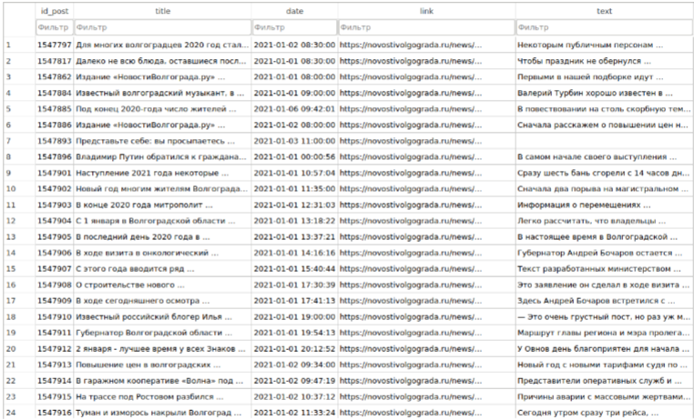
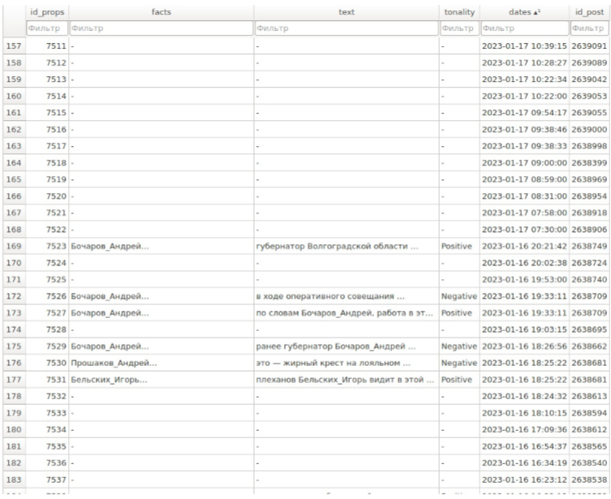
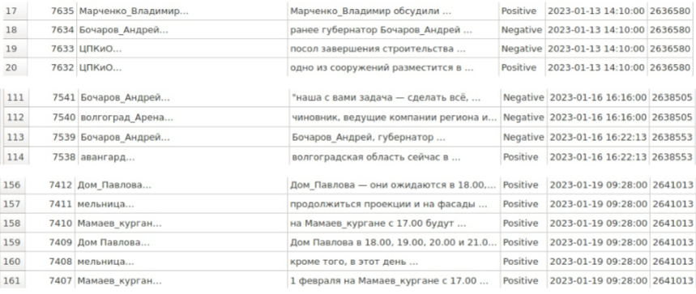
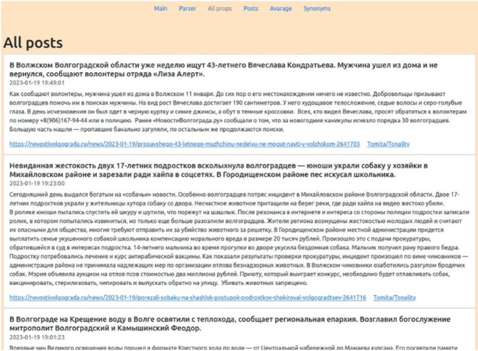
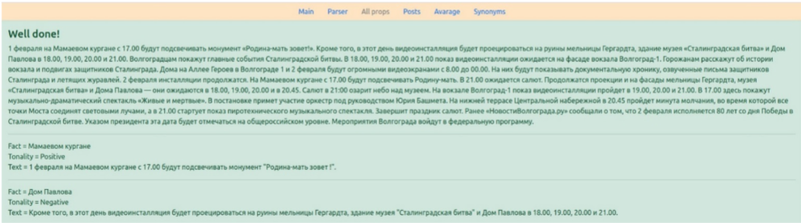
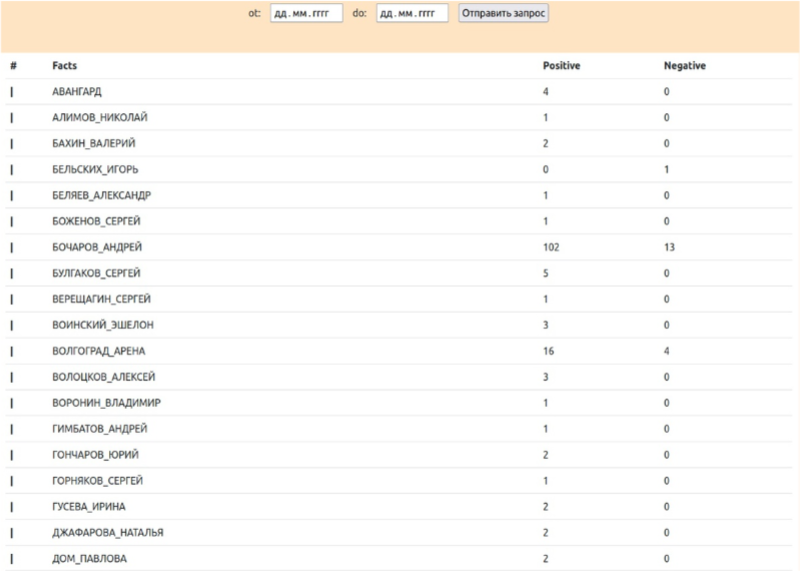
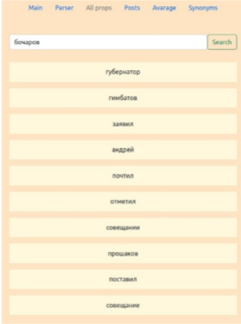

<h1 align="center"> :computer: Это репозиторий для анализа новостного сайта :computer: novostivolgograda</h1>
<h3 align="center"> (ссылка: https://www.novostivolgograda.ru/) </h3>

---

### Наш программный модуль умеет следующее: 
### :heavy_check_mark: "Парсинг" 10 000 новостных статей с сайта novostivolgograda,
### :heavy_check_mark: Выявление упоминаний об известных людях Волгограда,
### :heavy_check_mark: Выявление упоминаний об известных местах Волгограда, 
### :heavy_check_mark: Отображение проанализированной информации на веб-странице,
### :heavy_check_mark: Хранение данных в БД,
### :heavy_check_mark: Анализ тональности высказывания об известных людях и местах Волгограда, 
### :heavy_check_mark: Выявлять контекстные синонимы для известнхы людей и мест Волгограда,
### :heavy_check_mark: Вычисление среднего рейтинга п оперсоне или месту Волгограда на основе проанализирвоаннхы статей,
### :heavy_check_mark: Предоставлять визуализацию статистики упоминаний и тональности
#

  

---

<h3 align="center"> :fire: Наша команда: :fire: </h3>

#### :construction_worker: Samorokov Nikolay (nickname на GitHub: QuanRy)
#### :cop: Grigoriev Ivan (nickname на GitHub: Negibkaya)
#### :guardsman: Novruzov Sergey (nickname на GitHub: Sergey854223)

---

<h3 align="center"> :mag_right: Распределение обязанностей: :mag_right: </h3>

#### :hammer: Samorokov Nikolay (QuanRy) IVT-363 спарсил сайт (https://www.novostivolgograda.ru/). Новости помещаются в базу данных, далее хранятся там (если  новость уже присутствует в БД она не заносится в нее, а игнорируется). В качетсве БД используется SQlite
#### :wrench: Grigoriev Ivan (Negibkaya) IVT-363 оформил веб-интерфейс, выделил среди всех новостей, хранящихся в БД, с помощью tomita-парсера упоминание значимых персон Волгоградской области и достопримечательностей. Зафиксировал в БД предложения с их упоминанием для дальнейшего анализа тональности.
#### :nut_and_bolt: Novruzov Sergey (Sergey854223) IVT-363 проанализировал имеющиеся упоминания об известных людях и достопримечательностях в БД и выделил их "тональность". Создал программный модуль для проведения с помощью Spark MlLib анализа модели Word2Vec на всем объеме новостных статей из БД. Для персон Волгоградской области и достопримечательностей определил контекстные синонимы и слова, с которыми они упоминались в тексте.

---

### Работа парсера и БД

В качестве СУБД используется SQLite. Имеется база данных, в ней хранится несколько таблиц под названиями: 

Таблица «post» - хранит «спаршенные» новости,

## Поля таблицы «post»

- **id_post** *(integer)* – индекс новостной статьи.  
- **title** *(text)* – заголовок новостной статьи.  
- **date** *(text)* – дата публикации статьи.  
- **link** *(text)* – ссылка на статью.  
- **text** *(text)* – содержание новостной статьи.  

  
  
 Рисунок 1 –  Заполненная таблица post в БД  
 

 
Таблица «props» - хранит данные для анализа по тональности, содержит ФИО 
известного человека или название достопримечательности Волгоградской области, 
предложение, в котором о нем говорится, оценку по смысловой нагрузке 
(позитивная или негативная)

## Поля таблицы «props»

- **id_props** *(integer)* – индекс таблицы.  
- **facts** *(text)* – содержит ФИО известного человека или название достопримечательности Волгоградской области.  
- **text** *(text)* – предложение, в котором упоминалась известная личность или достопримечательность.  
- **tonality** *(text)* – тональность высказывания.  
- **dates** *(text)* – дата публикации новости, в которой упомянута известная личность или достопримечательность Волгоградской области.  
- **id_post** *(integer)* – индекс новости, в которой упомянута достопримечательность или персона.  

  
  
 Рисунок 2 – Заполненная таблица props в БД 
 

Тональность определяется у предложений, выявленных томита-парсером на 
втором этапе работы. Запуск модуля, отвечающего за тональность, осуществляется 
через файл tonality.py, расположенный по пути – sema/tonality/tonality.py.

  
  
 Рисунок 3 –  Хранение тональности высказывания в таблице «props» 
 

---

### Внешний вид и работа сайта

 Web-интерфейс страницы парсера выглядит следующим образом. Тут каждая новость отображается отдельно, с отображением всей обязательной информации, 
т.е. заголовок статьи, дату публикации, текст новости, ссылку на саму новость.

  
  
 Рисунок 4 – Отображение спаршенных новостей на нашем сайте 
 

Выделение персон и достопримечательностей Волгоградской области и 
помещение их в таблицу «props» выполняет скрипт sema/tomita/tomita.py. Перед 
запуском необходимо его поместить в папку с файлами persons.cxx, attractions.cxx, 
dic.gzt и facttypes.proto. (По умолчанию эти файлы и сам файл, отвечающий за 
томиту располагается в папке «sema/tomita/»)

  
  
 Рисунок 5 –  Пример выделяемых предложений томитой-парсером (+ тональность) на сайте 
 

Тональность также можно просмотреть отдельно, по всем спаршенным статьям (в кол-ве 10 000 штук).

  
  
 Рисунок 6 –  Пример работы тональности на нашем сайте (по всем статьям) 
 

Модель Word2Vec была обучена на новостных статьях из нашей базы данных 
из таблицы «post», объем которой составлял примерно 10 000 статей. Модель 
находится в папке sema/model. Например, если поискать синонимы к слову 
«Бочаров», которые наиболее часто употреблялись в 10000 новостях с искомым 
словом, то выдаст следующий результат:

  
  
 Рисунок 7 –  Пример Word2Vec на нашем сайте (по Бочарову) 
 

---

  

  

